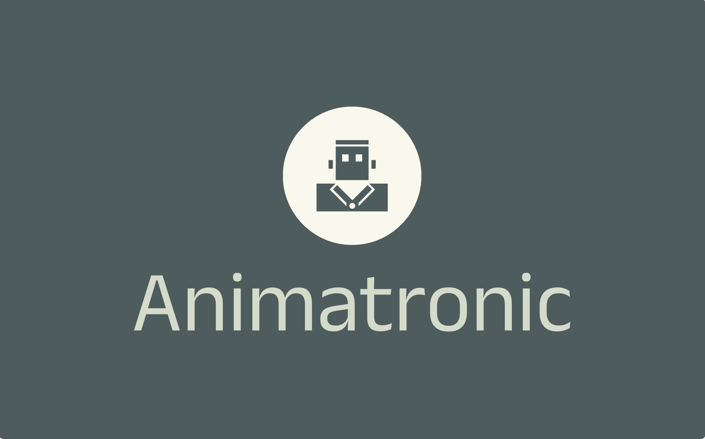

<h1 align="center">
  Animatronic
</h1>
<p align="center">
    
</p>
<h4 align="center">A library to animate numeric values with ease on NodeJS, Bun and Deno.</h4>

## What is is for?

This library is for animating numeric values, it can be used to animate anything that can be represented by a number, like the volume of a sound, the position of a servo motor, the brightness of a led, etc or even some [DMX](https://en.wikipedia.org/wiki/DMX512) channels values over time.

It is aim to be a simple and easy to use library, with a small footprint and no dependencies. The usage might be limited for big animations but it is perfect for small projects and to be used in embedded systems.

It's currently powering an Escape Room IoT device in production and it's working great.

While this is working in browser context, it is not the main focus of this library, and there are better alternatives for that. The main reason is that we are using `setTimeout` and `setInterval` to animate the values, and this is not the best approach for the browser, where we should use `requestAnimationFrame` instead.

## Usage

This library exports one single function and various Easing animations.

JSDocumentation is well defined and pretty self explanatory, but here is a quick example, for more advanced usage, please check the [documentation](./docs) folder.:

**Animating a PWM (Pulse Wave Modulation) value to dim a light bulb over time**

```ts
// For the sake of simplicity we have assume we have function `setPWMTo` that sets the PWM of a device between 0 and 255.

import {
  createAnimationController,
  Easing,
  type SegmentsConfig,
} from "animatronic";

// Generate segments that take a full trip from 0 to 255 and back to 0 in 10 seconds.
const simplePulseSegments: SegmentsConfig = [
  { initialValue: 0, duration: 5000, toValue: 255 },
  { duration: 5000, toValue: 0, easing: Easing.inOutBack }, // With some easing
];

// Create an animation controller
const controller = createAnimationController({
  fps: 20, // 20 times per seconds, generate a new value.
  loop: true, // Loop the animation
  segments: simplePulseSegments, // The animation to be used (the default one unless overridden on start).
});

state.lightMode.onChange((lightMode) => {
  switch (lightMode) {
    case "on":
      setPWMTo(255);
      break;
    case "animating":
      controller.start(setPWMTo);
      break;
    default:
      controller.stop();
      setPWMTo(0);
      break;
  }
});
```
